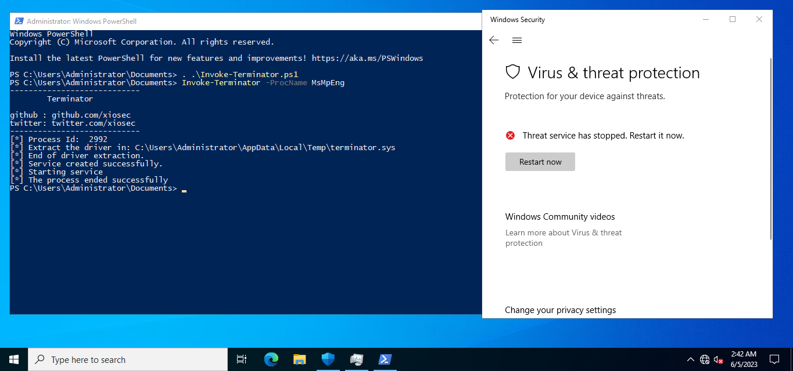

# Invoke-Terminator


[](https://github.com/xiosec/Terminator)
[](https://github.com/xiosec/Terminator)
[](https://github.com/xiosec/Terminator) [](https://github.com/xiosec/Terminator/releases/)
[](#license)
[](https://github.com/xiosec/Terminator/issues)

Terminator is a powershell script that terminates protected processes such as [anti-malware](https://learn.microsoft.com/en-us/windows/win32/services/protecting-anti-malware-services-) and `EDRs` through the [gmer](http://www.gmer.net/) driver.

* in-memory
* HVCI bypass

# Usage

```powershell
<#
----------------------------
        Terminator

github : github.com/xiosec
twitter: twitter.com/xiosec
----------------------------

* Arguments
    * -ServiceName
    * -ProcName
    * -ProcId
    * -driverPath
#>

Invoke-Terminator -ServiceName terminator -ProcName MsMpEng 
```
# Example
In this example, we kill the `MsMpEng` process, which is related to the `antimalware service`.


# Links

[gmer64.sys](https://www.loldrivers.io/drivers/7ce8fb06-46eb-4f4f-90d5-5518a6561f15/)

[Blackout](https://github.com/ZeroMemoryEx/Blackout)

# License 

Released under GPL-3.0 by [@xiosec](github.com/xiosec)